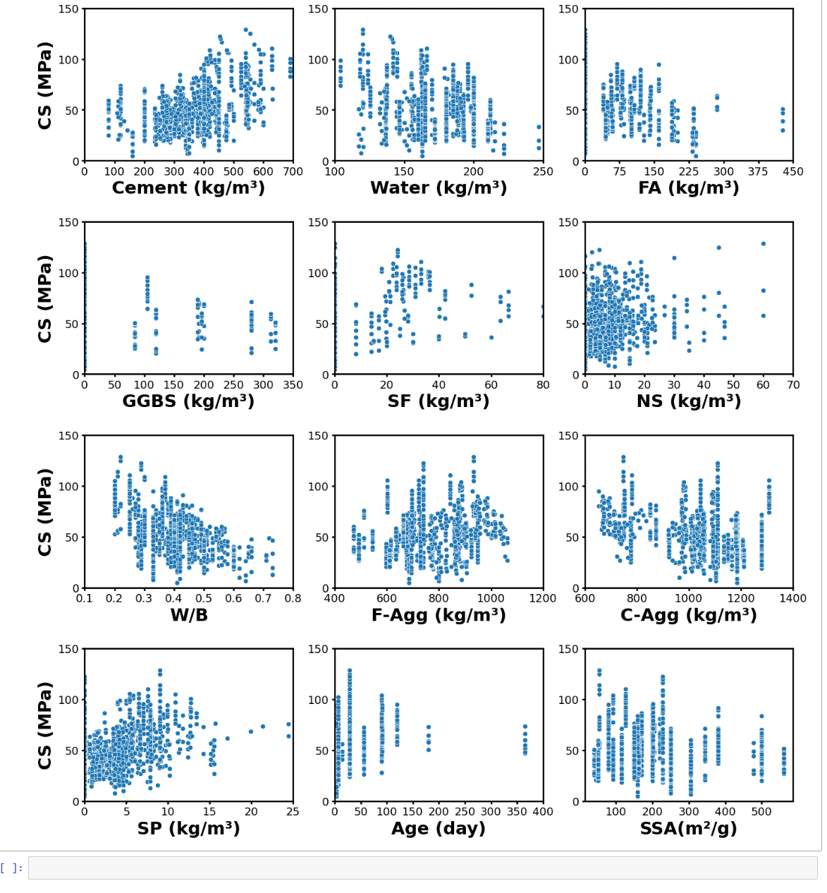
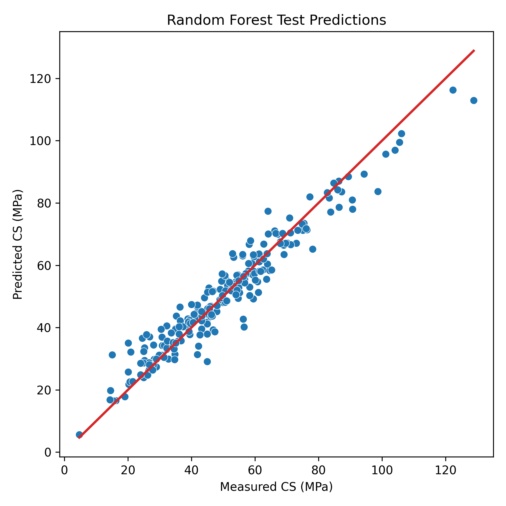
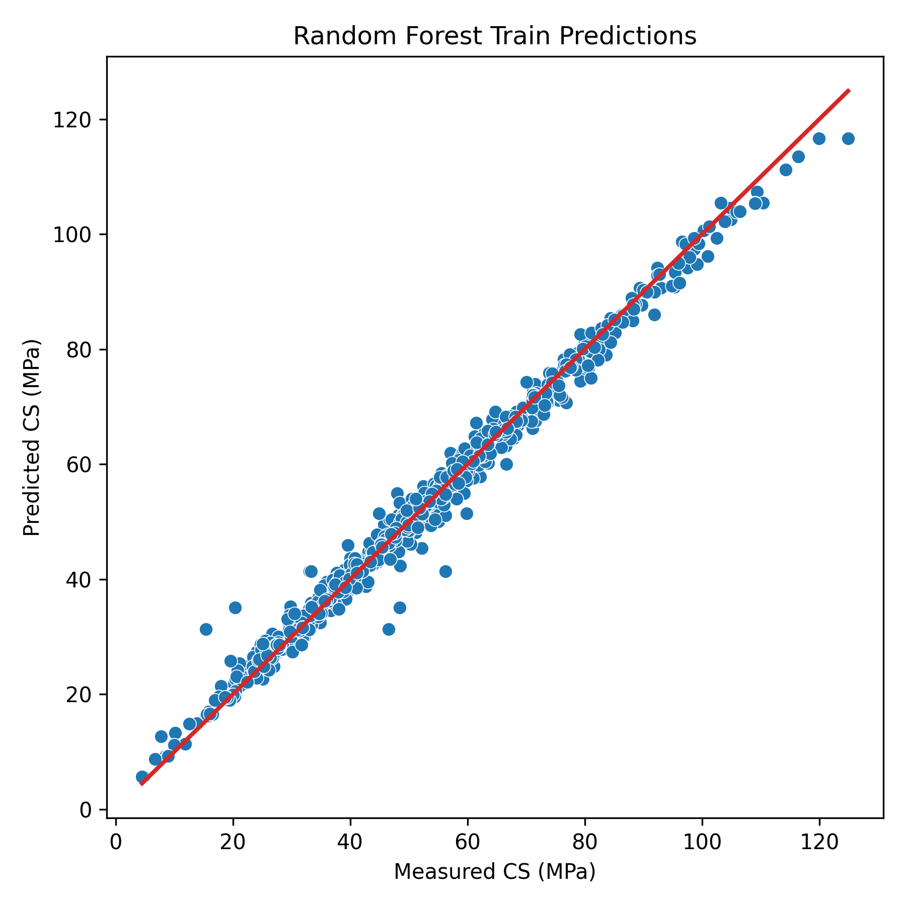
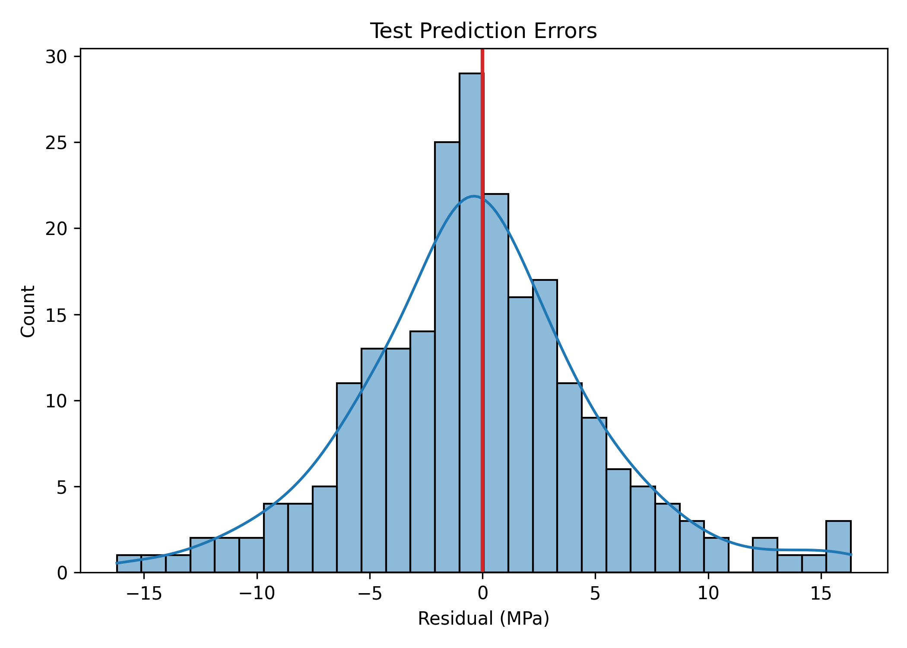
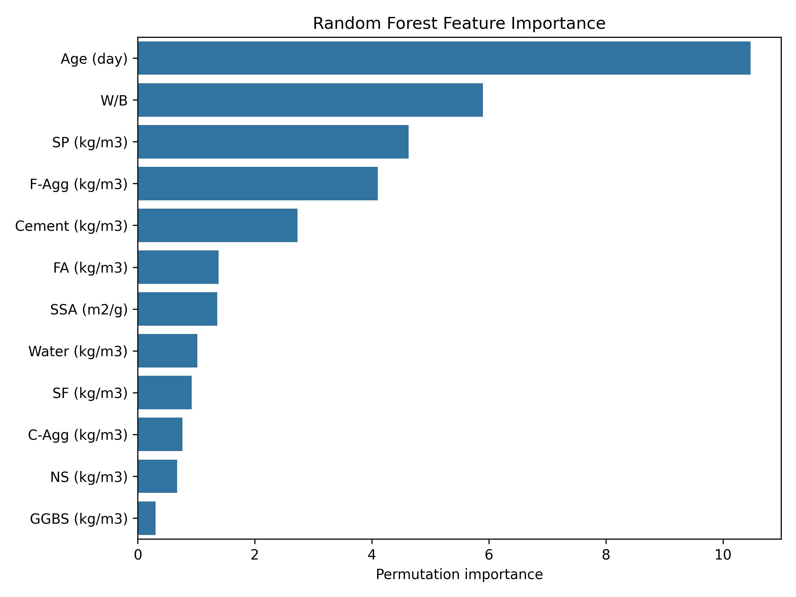

# Random Forest Prediction of Green Concrete Strength

This repository contains a reproducible machine learning workflow for predicting compressive strength of green concrete mixtures using a Random Forest regressor. It includes the modeling script, saved evaluation outputs, prediction examples, and figures suitable for reviewing the project directly on GitHub.

The project is based on a published concrete-strength study:

> Maherian et al. (2023), Construction and Building Materials, 408, 133684. DOI: [10.1016/j.conbuildmat.2023.133684](https://doi.org/10.1016/j.conbuildmat.2023.133684)

## Highlights

- Published-study context with DOI and citation.
- Single, reproducible Python workflow for data loading, model tuning, evaluation, and plotting.
- 80/20 train/test split with 5-fold cross-validation used only inside the training data.
- Saved metrics, prediction examples, permutation importance, and diagnostic plots.

## Quick Start

1. Place the dataset at `data/concrete_strength_data.csv`.
2. Install dependencies with `pip install -r requirements.txt`.
3. Run the one-file workflow:

```bash
python random_forest_concrete_strength.py
```

The script loads the dataset, standardizes column names, creates an 80/20 train/test split, tunes the Random Forest with cross-validation on the training set, evaluates final metrics on the held-out test set, saves the fitted model, and exports publication-ready figures.

## Project Structure

```text
.
+-- data/
|   +-- README.md
+-- models/
+-- results/
|   +-- README.md
|   +-- model_metrics.csv
|   +-- prediction_examples.csv
|   +-- permutation_importance.csv
|   +-- figures/
|       +-- actual_vs_predicted_test.png
|       +-- actual_vs_predicted_train.png
|       +-- feature_importance.png
|       +-- feature_strength_relationships.png
|       +-- prediction_errors_test.png
+-- random_forest_concrete_strength.py
+-- README.md
+-- requirements.txt
```

## Exploratory Relationship Graph

The graph below shows the measured compressive strength (`CS`) against the concrete mixture variables used in the study.



## Dataset

The dataset contains 1,143 concrete mixture records compiled from 39 published articles. Input variables include cement, water, fly ash, GGBS, silica fume, supplementary cementitious material content, water-binder ratio, fine aggregate, coarse aggregate, superplasticizer, curing age, and specific surface area. The target variable is compressive strength.

The dataset is not committed to this repository.

## Modeling Approach

The project uses a Random Forest regressor because it works well for nonlinear tabular relationships and provides a practical feature-importance summary. Hyperparameters are selected with `RandomizedSearchCV` using 5-fold cross-validation on the training set. The held-out test set is used only for final reporting.

## Outputs

When the dataset is available, the script writes:

- `results/model_metrics.csv`
- `results/prediction_examples.csv`
- `results/permutation_importance.csv`
- `models/random_forest_concrete_strength.joblib`
- generated figures under `results/figures/`

## Current Random Forest Results

The current run uses a fixed 80/20 train/test split with `random_state=42`. Hyperparameters are selected with 5-fold cross-validation inside the training data. `MASE` is the mean absolute error scaled by the train-set mean-baseline MAE.

| Split | R2 | MAE | MASE | MSE | RMSE | MAPE (%) |
| --- | ---: | ---: | ---: | ---: | ---: | ---: |
| Train | 0.988 | 1.434 | 0.090 | 4.824 | 2.196 | 3.440 |
| Test | 0.934 | 3.955 | 0.249 | 28.728 | 5.360 | 9.529 |

## Prediction And Diagnostic Plots

Actual versus predicted strength:



Training fit:



Prediction error distribution:



Permutation feature importance:



## Citation

If you use this repository or the dataset behind this work, please cite:

```bibtex
@article{maherian2023machine,
  title = {Machine learning-based compressive strength estimation in nano silica-modified concrete},
  author = {Maherian, Mahsa Farshbaf and Baran, Servan and Bicakci, Sidar Nihat and Toreyin, Behcet Ugur and Atahan, Hakan Nuri},
  journal = {Construction and Building Materials},
  volume = {408},
  year = {2023},
  doi = {10.1016/j.conbuildmat.2023.133684}
}
```
